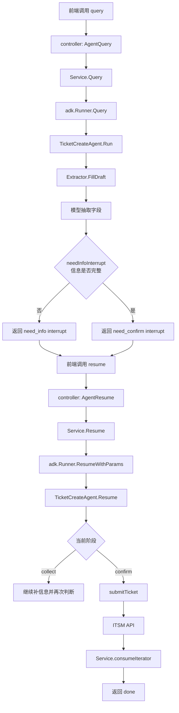
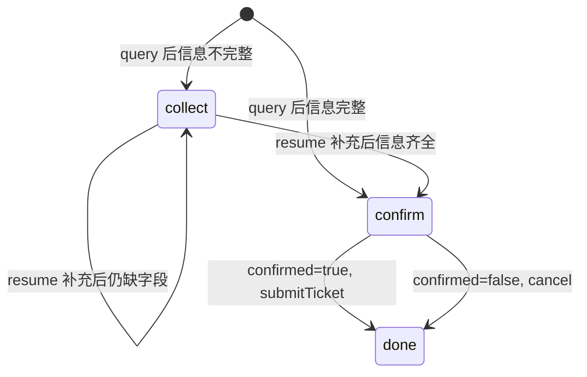
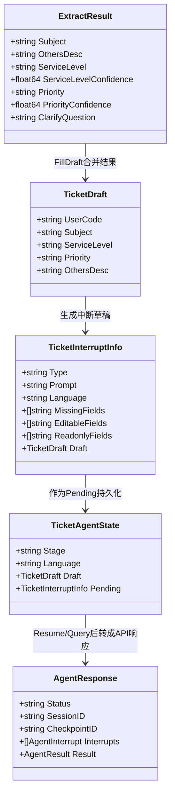

# Lakeside

本仓库基于 GoFrame，当前核心业务是一个校园 `IT 小助手`，其中 `itsm agent` 作为第一个 subagent 负责工单建单流程。

Quick Start:
- https://goframe.org/quick

## IT Assistant 概览

当前顶层 `IT 小助手` 已接入：
- 顶层接口：`/v1/assistant/query`、`/v1/assistant/resume`
- 第一个 subagent：`itsm`
- 顶层执行器：Eino ADK `ChatModelAgent`
- 官方 middleware：`Summarization`、`PatchToolCalls`
- 会话消息原文存储
- ADK checkpoint 持久化
- 异步长期记忆提取

当前顶层流程是：
1. 记录用户消息
2. 读取用户长期记忆并组装 `assistant_context`
3. 顶层 `ChatModelAgent` 决定直接回复还是调用 `itsm` subagent
4. `Summarization Middleware` 在上下文过长时自动压缩历史
5. `PatchToolCalls Middleware` 在 resume 前修补悬空 tool call
6. 保存 assistant 可见回复
7. 异步提取长期记忆

当前持久化内容包括：
- `assistant_sessions`
- `assistant_messages`
- `assistant_memories`

`assistant_summaries` 表暂时保留，但当前主链路优先使用 ADK `Summarization Middleware` 做上下文压缩，不再在请求链路中手写滚动摘要。

长期记忆调试接口：
- `GET /v1/assistant/memories`：查看当前用户长期记忆
- `POST /v1/assistant/memories/clear`：清除当前用户长期记忆

注意：
- 当前 `assistant_context` 只会注入 `assistant_memories`，不会注入 `assistant_summaries`
- 如果助手在新会话里“知道”了宿舍位置、偏好老师等信息，优先去查 `assistant_memories`

首期开发版使用 SQLite 持久化仓储，结构设计按后续切换 MSSQL 兼容来约束。

## 测试说明

- 日常回归：`go test ./...`
- 顶层 assistant 的单元测试位于 `internal/service/assistant`
- 可选 live 联调测试位于 `test/integration`
- 当本地服务运行在 `127.0.0.1:8011` 时，可直接执行：

```bash
LAKESIDE_RUN_LIVE_TESTS=1 \
LAKESIDE_TEST_USER_ID=122020255 \
go test ./test/integration -run Live -v
```

- 若要测试 `resume`，可额外传入完整请求体：

```bash
LAKESIDE_RUN_LIVE_TESTS=1 \
LAKESIDE_TEST_USER_ID=122020255 \
LAKESIDE_LIVE_RESUME_BODY='{"session_id":"sess-xxx","checkpoint_id":"ckpt-xxx","targets":{"interrupt-id":{"confirmed":true}}}' \
go test ./test/integration -run Resume -v
```

## ITSM Agent 概览

当前 ITSM agent 的目标是：
- 从用户自然语言中抽取工单字段
- 信息不完整时中断并追问用户
- 信息齐全后让用户二次确认
- 用户确认后调用下游 ITSM API 创建工单
- 对重复确认做幂等保护

当前流程分两层：
1. 模型负责抽取字段，并在不确定时给出补充提问建议。
2. Go 代码负责判断字段是否已经完整，决定是继续追问还是进入确认阶段。

也就是说，是否“信息完整”不是完全由模型自由决定，而是以服务端代码中的规则为准。

## 调用链总览

从 HTTP 请求到工单创建，主链路如下：

1. 前端调用 `POST /v1/itsm/agent/query`
2. controller 把请求转换为 `itsmagent.QueryRequest`
3. `Service.Query` 创建 `session_id` 和 `checkpoint_id`
4. `Service.Query` 调用 `adk.Runner.Query`
5. `TicketCreateAgent.Run` 调用 `Extractor.FillDraft`
6. `Extractor.FillDraft` 调用模型抽取字段
7. `TicketCreateAgent.needInfoInterrupt` 判断是否缺信息
8. 如果缺信息，ADK 返回 interrupt，API 响应 `need_info`
9. 如果信息齐全，`TicketCreateAgent.buildConfirmInterrupt` 返回确认 interrupt，API 响应 `need_confirm`
10. 前端调用 `POST /v1/itsm/agent/resume`
11. controller 把 `targets` 转成 `ResumeRequest`
12. `Service.Resume` 调用 `adk.Runner.ResumeWithParams`
13. `TicketCreateAgent.Resume`
14. `collect` 阶段继续补信息；`confirm` 阶段确认后调用 `submitTicket`
15. `submitTicket` 调用下游 ITSM API
16. `Service.consumeIterator` 把 ADK 结果转换为最终 API 响应 `done`







## 代码职责划分

### `internal/service/itsmagent/service.go`

这一层是 API 与 ADK 之间的编排层，主要负责：
- 初始化 `Runner`
- 生成 `session_id` / `checkpoint_id`
- 组织 `ResumeParams.Targets`
- 消费 ADK 事件流并转成接口响应
- 管理 checkpoint 生命周期

如果你想查接口为什么返回 `need_info / need_confirm / done`，先看这里。

### `internal/service/itsmagent/agent.go`

这一层是业务状态机，主要负责：
- 首次运行 `Run`
- 中断后恢复 `Resume`
- 判断信息是否完整
- 构造中断提示
- 调用工单系统提交
- 处理幂等

如果你想改流程阶段、补信息规则、确认规则、提交时机，主要看这里。

### `internal/service/itsmagent/extractor.go`

这一层只负责“从用户自然语言里抽字段”，主要负责：
- 组织 prompt
- 调用 chat model
- 解析模型返回 JSON
- 把抽取结果合并回 `TicketDraft`

如果你想改“AI 怎么理解用户输入、怎么追问更像人工客服”，主要看这里。

## 状态流转

当前状态机只有两个业务阶段：

1. `collect`
作用：补充缺失信息  
中断类型：`need_info`

2. `confirm`
作用：让用户确认草稿，必要时允许微调  
中断类型：`need_confirm`

当 `confirm` 阶段用户确认后，流程进入提交，不再产生新的人工确认中断，最终返回 `done`。

`TicketAgentState` 会被 ADK checkpoint 持久化，其中包含：
- 当前阶段 `Stage`
- 当前语言 `Language`
- 当前草稿 `Draft`
- 当前待恢复的中断信息 `Pending`

这也是为什么 `resume` 只需要 `checkpoint_id + interrupt_id + targets` 就能继续。

## 信息完整性判断位置

完整性判断在：
- `internal/service/itsmagent/agent.go`
- 函数：`needInfoInterrupt`

当前规则包括：
- `subject` 不能为空
- `othersDesc` 不能为空
- `serviceLevel` 必须是合法枚举 `1~4`
- `priority` 必须是合法枚举 `1~4`
- 即使枚举值合法，如果模型返回的置信度低于阈值，也仍然视为不完整

相关调用链：
- 首次提问：`Run -> extractor.FillDraft -> needInfoInterrupt`
- 补充信息：`Resume(stageCollect) -> extractor.FillDraft -> needInfoInterrupt`

如果需要修改“什么样的工单才算完整”，优先改这里。

## 模型抽取与追问提示词位置

模型抽取提示词在：
- `internal/service/itsmagent/extractor.go`
- 函数：`buildExtractPrompt`

这里定义了模型需要做的事情：
- 从用户输入中提取工单字段
- 不确定时保留空值
- 通过 `clarify_question` 给出下一轮应追问用户的内容

当前关键规则包括：
- `subject/othersDesc` 应简洁可用
- `serviceLevel`、`priority` 都要映射为固定枚举值
- 如果不确定，就留空并返回 `clarify_question`
- `clarify_question`、`subject`、`othersDesc` 尽量跟随用户输入语言

如果需要告诉 AI “什么才算完整工单”“缺字段时该如何引导用户”，优先改这里。

## 追问文案生成位置

用户实际看到的补充提示文案在：
- `internal/service/itsmagent/agent.go`
- 函数：`needInfoInterrupt`
- 辅助函数：`missingFieldLabels`

当前逻辑：
- 先根据缺失字段生成主提示，例如“请补充：服务级别、工单类型”
- 如果模型返回了 `clarify_question`，则拼接为“补充说明”
- 固定提示文案会根据用户语言在中文和英文之间切换

如果需要修改字段中文名称或主提示文案，可改这两处。

## 语言策略

当前实现中，语言策略分两部分：

1. 固定提示文案  
在 `agent.go` 中根据用户输入做简单语言判断：
- 中文输入 -> 中文固定提示
- 非中文输入 -> 英文固定提示

2. 模型生成内容  
在 `extractor.go` 的 prompt 里要求：
- `clarify_question`
- `subject`
- `othersDesc`

尽量使用与用户输入相同的语言。

当前固定文案层面只区分“中文 / 非中文”。如果后续需要更细的多语言支持，可以继续扩展语言识别和文案模板。

## 常见排查入口

### `query` 很慢

优先看：
- `internal/controller/itsm/itsm_v1_agent_query.go`
- `internal/service/itsmagent/service.go`
- `internal/service/itsmagent/extractor.go`

通常慢点在模型抽取，不在 ADK interrupt 本身。

### `missing_fields` 和 prompt 不一致

优先看：
- `internal/service/itsmagent/agent.go`
- 函数：`needInfoInterrupt`

主提示来自缺失字段；`clarify_question` 只是补充说明。

### `resume` 后没有继续

优先看：
- `Service.Resume` 是否把 `targets` 正确映射到 `ResumeCollectData / ResumeConfirmData`
- `interrupt_id` 是否与上一次返回的一致
- `checkpoint_id` 是否仍然有效

### 工单重复创建

优先看：
- `agent.go`
- 函数：`submitTicket`
- 函数：`idempotencyKey`

当前逻辑使用 `checkpoint_id + 草稿摘要` 做幂等键。

## 如何新增一个必填槽位

如果后续要把某个信息升级为真正的必填槽位，例如“联系方式”“设备编号”“宿舍位置”，建议按下面顺序改，避免只改一半导致流程不一致。

### 第一步：定义草稿字段

先在 `internal/service/itsmagent/types.go` 的 `TicketDraft` 中新增字段。

例如：
- `ContactPhone string`
- `DeviceID string`

这一步的意义是：让该信息成为 agent 内部的正式槽位，而不是继续混在 `subject` 或 `othersDesc` 的自由文本里。

### 第二步：扩展模型输出结构

在 `internal/service/itsmagent/types.go` 的 `ExtractResult` 中新增同名字段。

例如：
- `ContactPhone string`
- `DeviceID string`

否则即使 prompt 要求模型抽取，服务端也接不到这个字段。

### 第三步：修改抽取提示词

在 `internal/service/itsmagent/extractor.go` 中修改：
- `buildExtractPrompt`

需要同时改三处：
1. JSON schema 中加入新字段
2. 规则中写明什么情况下必须抽取该字段
3. 缺失时应该如何追问用户

例如可以写：
- 如果缺少联系方式，优先追问可回拨手机号
- 如果缺少设备编号，优先追问设备标签或序列号

### 第四步：把模型结果合并回草稿

在 `internal/service/itsmagent/extractor.go` 的 `FillDraft` 中，把 `ExtractResult` 的新字段回填到 `TicketDraft`。

如果这一步漏掉，模型虽然可能返回了字段，后续完整性判断仍然会认为它缺失。

### 第五步：加入完整性判断

在 `internal/service/itsmagent/agent.go` 的 `needInfoInterrupt` 中，把新字段纳入缺失判断。

例如：
- 为空则加入 `missing`
- 如果存在格式校验，也在这里做最终裁决

这一步决定了系统是否继续返回 `need_info`。

### 第六步：补充字段中文标签

在 `internal/service/itsmagent/agent.go` 的 `missingFieldLabels` 中新增这个字段的展示名称。

例如：
- `contactPhone -> 联系电话`
- `deviceID -> 设备编号`

否则前端看到的提示会直接暴露内部字段名。

### 第七步：确认是否允许在确认阶段编辑

如果新字段需要在 `need_confirm` 阶段允许前端修改，则要同步修改：
- `buildConfirmInterrupt`
- API 层的确认输入结构
- OpenAPI 示例和字段说明

如果不允许前端修改，则只需要加入只读展示。

### 第八步：同步 API 展示结构

如果这个字段要返回给前端展示或编辑，还需要同步：
- `api/itsm/v1/agent.go` 中的 `TicketDraft`
- 相关 `dc` 说明
- examples
- OpenAPI patch 示例

否则后端内部虽然有这个字段，前端文档里看不到。

### 第九步：补测试

至少补两类测试：

1. 抽取/提示测试
- 新字段缺失时，提示里能体现该字段
- 新字段存在时，不再重复追问

2. 完整性测试
- 新字段为空 -> 返回 `need_info`
- 新字段齐全 -> 可以进入 `need_confirm`

## 新增槽位的最小检查清单

新增一个必填字段时，至少检查下面这些位置是否都改到了：

- `types.go` 的 `TicketDraft`
- `types.go` 的 `ExtractResult`
- `extractor.go` 的 `buildExtractPrompt`
- `extractor.go` 的 `FillDraft`
- `agent.go` 的 `needInfoInterrupt`
- `agent.go` 的 `missingFieldLabels`
- `api/itsm/v1/agent.go` 的返回结构和 examples
- 对应测试

只改 prompt、不改完整性判断，字段不会真正变成必填。  
只改完整性判断、不改抽取与 API，用户体验会很差。
