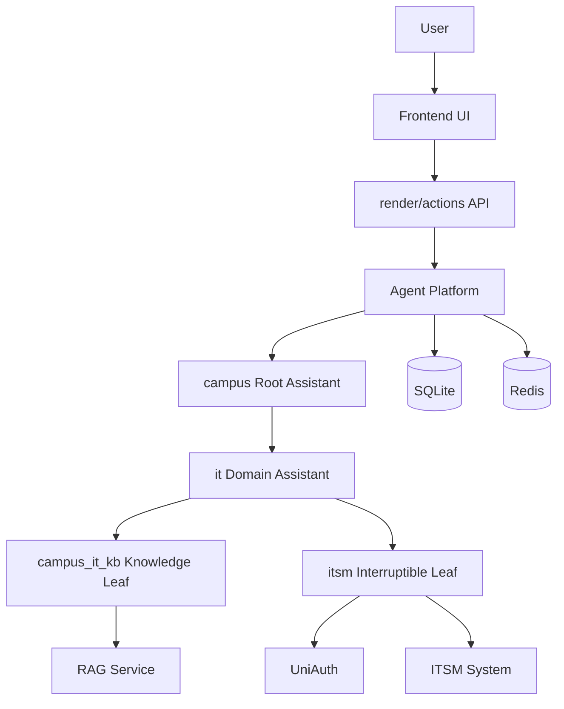
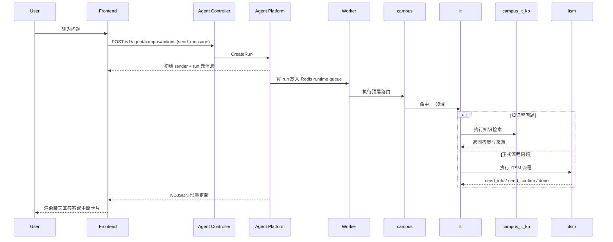

# Lakeside

Lakeside 是一个面向校园场景的分层 Agent 平台。当前主产品实例包括 `campus` 与 `research`：前者采用 **顶层助手 -> 领域助手 -> 叶子能力** 的结构，把知识问答、排障建议和正式 ITSM 工单流程统一到同一个会话模型里；后者把开放式深度研究任务路由到 DeerFlow 执行。

前端主产品协议已经切到 **session-first + server-driven UI**：

- 会话事实来源是 `session + messages`
- 后端通过 `render/actions` 驱动中间聊天区
- 页面壳子、历史会话列表仍由前端平台自己渲染

## 一句话架构

`campus` 是一个**薄顶层编排器**：  
它自己不持有具体校园知识，也不直接实现工单流程，只负责把请求路由到领域助手；当前已接入的领域是 `it`，而 `it` 再按计划调用 `knowledge` 或 `itsm` 这两类叶子能力。

## 当前落地拓扑

| 层级 | Key | 职责 | 当前状态 |
| --- | --- | --- | --- |
| Root | `campus` | 顶层总控，做模块 assessment、route plan、fan-out 与结果合并 | 已启用 |
| Root | `research` | 深度研究顶层入口，把任务路由到 `deep_research` 领域 | 已启用 |
| Domain | `it` | 校园 IT 领域编排，执行 `assessment + planner + workflow` | 已启用 |
| Domain | `deep_research` | 深度研究领域编排，负责把任务交给 DeerFlow 执行 | 已启用 |
| Leaf | `campus_it_kb` | 面向普通师生的校园 IT 知识检索 tool，通过外部 RAG 服务回答 | 已启用 |
| Leaf | `itsm` | 正式 IT 支持流程，支持补信息、确认、提单 | 已启用 |
| Leaf | `deerflow_research` | 调用 DeerFlow 深度研究引擎，处理开放式研究、资料整理和长报告生成 | 已启用 |
| Leaf | `campus_it_kb_for_itso_student_assistant` | ITSO 学生助理内部知识 | 预留，当前配置未启用 |

## Campus 架构图


```mermaid
graph TB
    U[User]
    FE[Frontend UI]
    API[render/actions API]
    AP[Agent Platform]
    ROOT[campus Root Assistant]
    IT[it Domain Assistant]
    KB[campus_it_kb Knowledge Leaf]
    ITSM[itsm Interruptible Leaf]
    RAG[RAG Service]
    UA[UniAuth]
    EXTITSM[ITSM System]
    SQLITE[(SQLite)]
    REDIS[(Redis)]

    U --> FE
    FE --> API
    API --> AP
    AP --> ROOT
    ROOT --> IT
    IT --> KB
    IT --> ITSM
    KB --> RAG
    ITSM --> UA
    ITSM --> EXTITSM
    AP --> SQLITE
    AP --> REDIS
```

## 设计原则

- `campus` 必须保持薄：只负责顶层路由与编排，不承载具体领域知识。
- 领域模块统一走 `assessment + planner + workflow`，不再保留 supervisor fallback。
- `knowledge` 优先实现为 tool，再包一层薄 agent adapter 以兼容当前编排。
- `itsm` 作为中断型叶子 agent，专门处理正式流程，不负责优先回答 FAQ 或排障步骤。
- Redis 只承担 checkpoint、runtime queue、幂等和缓存等平台职责，不承载知识库语义。
- 主产品以 `session + messages` 为事实来源，长期记忆只作为增强注入。
- `render/actions` 只负责中间聊天区的 chat surface，不接管整页。

## 分层职责

| 层 | 主要职责 | 关键实现 |
| --- | --- | --- |
| Agent Platform | registry、runtime、checkpoint、session、memory、response、worker | `internal/service/agentplatform/` |
| Root Assistant | 顶层问题域路由、模块并发/串行编排、结果合并 | `internal/service/rootassistant/` |
| Domain Assistant | 领域 assessment、planner、叶子工作流编排 | `internal/service/domainassistant/` |
| Leaf Agent / Tool | 具体能力执行，如知识检索 tool、ITSM 提单 | `internal/service/leafagent/` |
| Infra | 外部系统适配，如 RAG 服务、Redis、UniAuth | `internal/infra/` |

## Campus 的真实执行逻辑

### 1. Root 层：只决定“交给哪个领域”

`campus` 收到用户问题后，先并行调用各领域模块的 `Assess()`，判断：

- 这个问题属于哪个领域
- 是偏 `read` 还是偏 `write`
- 是否需要先澄清

当前配置里 `campus` 的子领域只有 `it`，但结构已经支持未来继续挂 `hr`、`osa` 等领域。

Root 层的策略是：

- `read` 模块可以并行 fan-out
- `write` 模块按顺序执行
- 如果没有可靠命中，则返回顶层 clarify 或 fallback

### 2. IT 领域：固定走 `assessment + planner + workflow`

`it` 领域不再是一个“大模型自由发挥”的 supervisor，而是一个结构化工作流：

1. `assessment`
   - 判断当前请求是否属于 IT 域
   - 判断是知识型诉求还是正式流程型诉求
2. `planner`
   - 产出结构化叶子执行计划
   - 例如只调 `campus_it_kb`
   - 或先调 `campus_it_kb`，再调 `itsm`
3. `workflow`
   - 按计划顺序执行叶子能力

如果 planner 失败：

- 先尝试 heuristic fallback，自动兜成可执行计划
- 仍然无法稳定规划时，不把内部错误直接暴露给用户，而是进入 clarify interrupt

### 3. Leaf 层：知识和正式流程分离

| 叶子能力 | 类型 | 适合处理的问题 | 是否会中断 |
| --- | --- | --- | --- |
| `campus_it_kb` | Knowledge tool + thin agent adapter | FAQ、操作步骤、安装指引、排障建议、流程说明；底层调用外部 RAG 服务 | 否 |
| `itsm` | Interruptible agent | 报修、投诉、正式 IT 支持请求、提交工单 | 是 |

这意味着：

- “VPN 怎么连接 / WiFi 连不上怎么办”应优先走 `knowledge`
- “还是不行，帮我提交工单”应走 `itsm`
- “先告诉我怎么排查，再帮我提工单”会先 `knowledge`，再 `itsm`

补充说明：

- `knowledge` 的实现形态是 Eino `tool`
- 当前之所以还能在 `leafagent/knowledge` 下拿到 agent，是为了兼容现有 workflow 编排的薄 adapter
- Redis 不是知识库，也不负责存放 RAG 文档

## 一次典型请求的时序


```mermaid
sequenceDiagram
    participant User
    participant FE as Frontend
    participant API as Agent Controller
    participant AP as Agent Platform
    participant W as Worker
    participant Root as campus
    participant IT as it
    participant KB as campus_it_kb
    participant Ticket as itsm

    User->>FE: 输入问题
    FE->>API: POST /v1/agent/campus/actions (send_message)
    API->>AP: CreateRun
    AP-->>FE: 初始 render + run 元信息
    AP->>W: 将 run 放入 Redis runtime queue
    W->>Root: 执行顶层路由
    Root->>IT: 命中 IT 领域
    alt 知识型问题
        IT->>KB: 执行知识检索
        KB-->>IT: 返回答案与来源
    else 正式流程问题
        IT->>Ticket: 执行 ITSM 流程
        Ticket-->>IT: need_info / need_confirm / done
    end
    AP-->>FE: NDJSON 增量更新
    FE-->>User: 渲染聊天区答案或中断卡片
```

## 当前主产品协议

### 主入口

| 接口 | 用途 |
| --- | --- |
| `GET /v1/agent/{assistant_key}/render` | 获取当前会话的 chat surface 快照 |
| `POST /v1/agent/{assistant_key}/actions` | 回传用户动作，并流式返回更新 |
| `GET /v1/agent/{assistant_key}/sessions` | 获取历史会话列表 |
| `POST /v1/agent/{assistant_key}/sessions` | 显式创建空白会话 |
| `DELETE /v1/agent/{assistant_key}/sessions/{session_id}` | 删除会话 |
| `GET /v1/agent/{assistant_key}/memories` | 查看长期记忆 |
| `POST /v1/agent/{assistant_key}/memories/clear` | 清理长期记忆 |

### `render/actions` 消息语义

`render/actions` 返回 `application/x-ndjson`，当前主要使用这些 A2UI v0.8 语义消息：

- `deleteSurface`
- `surfaceUpdate`
- `dataModelUpdate`
- `beginRendering`

后端只驱动**中间聊天区**；页面壳子、历史会话列表仍由前端渲染。

### Research / DeerFlow 聊天面语义

`research -> deep_research -> deerflow_research` 这条链路仍然复用同一套 `render/actions` NDJSON 协议，但聊天区会额外携带 DeerFlow 轨迹数据：

- `dataModel.deerflow.traceJson`：序列化后的 DeerFlow trace
- trace 里包含 `thread_id`、`run_id`、`run_status`、`title`
- trace 里包含 DeerFlow `messages`、`todos`、`sources`、`artifacts`
- source 会被归类为 `official / benchmark / provider / media / community / unknown`
- source 会被标成 `high / medium / low` 可信度，并暴露 `low_confidence`

前端 research 页在检测到 `deerflow.traceJson` 后，会切换到 DeerFlow 专用 renderer，而不是继续使用通用消息泡泡。这个 renderer 会展示：

- 研究计划 / todo
- 处理中步骤（thinking、tool call、搜索结果、子任务、文件输出）
- 资料来源及其可信度标签
- 质量告警，例如低可信来源、工具失败、尾部状态诊断

会话详情或 render 刷新时，如果 snapshot 里尚未固化 DeerFlow trace，后端会从最新 `deerflow_trace_updated` 事件回填 trace，保证 research 会话恢复后仍能复原 DeerFlow 原生过程视图。

另外，若 DeerFlow 终态没有可见文本，Lakeside 不再把它当成“完成但空白”，而是会把 run 显式标成 `failed`，并回填：

- `thread_id`
- `run_id`
- `run_status`
- `state_tail`

### 当前动作名

| 动作名 | 含义 |
| --- | --- |
| `send_message` | 发送新消息 |
| `follow_up_submit` | 提交补充信息 |
| `approval_submit` | 确认或取消正式流程 |
| `cancel_turn` | 取消当前运行 |

## 会话、运行态与中断

### 会话模型

主产品事实来源是：

- `session`：一次对话
- `messages`：该会话的历史消息
- `memories`：长期事实记忆，只做增强注入

### 运行态约定

前端显示“处理中”只认：

- `queued`
- `running`

以下状态都视为**非运行态**：

- `waiting_input`
- `done`
- `failed`
- `cancelled`

### ITSM 中断语义

`itsm` 叶子能力当前保留自定义可中断状态机：

1. 抽取工单草稿
2. 信息不足时进入 `need_info`
3. 信息齐全后进入 `need_confirm`
4. 用户确认后真正提交 ITSM

在主产品里，这些中断会被映射成黄色补充信息卡或确认卡片。

## 持久化与基础设施

### SQLite

| 表 | 用途 |
| --- | --- |
| `agent_sessions` | 会话元数据 |
| `agent_messages` | 聊天历史事实来源 |
| `agent_memories` | 长期记忆 |
| `agent_runs` | 一次后台执行 |
| `agent_run_events` | 执行事件日志，主要用于调试 |

### Redis

| Key / 机制 | 用途 |
| --- | --- |
| `lakeside:interactive:rootassistant:checkpoint:v1:` | 顶层助手 checkpoint |
| `lakeside:interactive:it:subagent:itsm:checkpoint:v1:` | ITSM checkpoint |
| `lakeside:interactive:it:subagent:itsm:idempotency:v1:` | ITSM 幂等结果 |
| `lakeside:interactive:it:subagent:itsm:signal:*` | ITSM 相似问题聚合 |
| `lakeside:shared:embedding:cache:v1:` | embedding 共享缓存 |
| `agents.runtime.streamKey` | run 队列 |
| `agents.runtime.pubsubChannel` | run 事件广播 |

Redis 在本仓库中是**必需依赖**。

但 Redis 的作用仅限于平台运行时：

- checkpoint
- idempotency
- runtime queue / pubsub
- embedding cache

知识检索本身走的是外部 RAG 服务，而不是 Redis。

## 身份语义

对外请求头仍然保持：

- `X-User-ID`

但其值语义统一为：

- `UPN`

当前落地方式：

- 调知识库 RAG 时，把 `X-User-ID` 透传为 `x-user-upn`
- 调 ITSM 前，通过 `UniAuth` 把 UPN 转成下游需要的 `employeeId`

## 配置驱动装配

当前 agent 树主要由 [manifest/config/config.yaml](./manifest/config/config.yaml) 驱动：

| 配置段 | 作用 |
| --- | --- |
| `agents.roots[]` | 定义顶层助手，如 `campus` |
| `agents.domains[]` | 定义领域助手，如 `it` |
| `agents.leaves[]` | 定义叶子能力，如 `itsm`、`campus_it_kb` |
| `instructionTemplate` | 定义 root/domain 路由提示词模板 |
| `children` | 定义节点之间的父子关系 |

也就是说，当前的 agent 目录、父子关系和大部分路由提示词都不是硬编码在 Go 里，而是**配置驱动 + 代码装配**。

## 当前边界与演进方向

当前已经稳定落地的只有：

- `campus -> it -> { campus_it_kb, itsm }`

未来继续扩展时，整体结构不变，只需：

1. 新增领域模块或叶子能力
2. 在配置里注册新的 root/domain/leaf
3. 让 `campus` 继续只做顶层编排

因此这个架构的核心价值是：

- 能把校园问题拆成清晰层级
- 能同时支持 FAQ/知识问答与正式流程型事务
- 能在不推翻整体结构的前提下继续扩展到 HR、OSA、邮件、编程等更多助手

## 部署说明

本项目当前按 **Go 二进制 + k8s 挂载配置** 的方式运行。

生产环境不要把真实 `config.yaml` 打进镜像；建议通过 Secret / ConfigMap 挂载运行时配置文件。

## 本地联调启动方式

本地联调 `campus` 主产品时，通常不只是启动本仓库，还需要把依赖服务一起拉起来。当前推荐至少启动以下 5 个服务：

| 顺序 | 服务 | 工作目录 | 为什么需要 |
| --- | --- | --- | --- |
| 1 | Redis | 任意 | `lakeside` 的 checkpoint、runtime queue、幂等和缓存依赖 Redis |
| 2 | UniAuth 后端 | `../UniAuth/uniauth-gf` | ITSM 提交前需要把 `UPN -> employeeId` |
| 3 | 对话后端 ChatGPT-Azure | `../ChatGPT-Azure` | 当前 UI 的配额池信息获取依赖它 |
| 4 | Lakeside 后端 | 当前仓库 | 提供 `/v1/agent/{assistant_key}/render` 与 `/actions` |
| 5 | UI 前端 | `../UI` | 主产品页面入口，默认本地开发地址是 `http://localhost:5173` |

### 1. Redis

本地联调前请先确保 Redis 已启动，并且 `lakeside` 能访问到配置中的 Redis 地址。

### 2. UniAuth 后端

工作目录：`../UniAuth/uniauth-gf`

```bash
go run .
```

也可以用 GoFrame CLI：

```bash
gf run main.go
```

### 3. ChatGPT-Azure 后端

工作目录：`../ChatGPT-Azure`

```bash
uvicorn --host 0.0.0.0 --port 8000 ChatGPT_Azure.asgi:application --reload
```

当前主产品 UI 里的配额池信息获取依赖这个后端；如果它没启动，前端会出现相关请求失败。

### 4. Lakeside 后端

工作目录：当前仓库

```bash
go run main.go
```

运行模式：

- `all`：HTTP + worker（默认）
- `api`：仅 HTTP
- `worker`：仅 worker

默认地址：

- `http://127.0.0.1:8011`
- OpenAPI: `http://127.0.0.1:8011/api.json`
- Swagger: `http://127.0.0.1:8011/swagger/`

### 5. UI 前端

工作目录：`../UI`

首次需要安装依赖：

```bash
pnpm install
```

启动开发服务器：

```bash
pnpm run dev
```

默认本地入口通常是：

- `http://localhost:5173`

## 仅启动 Lakeside 后端

如果你只是调试本仓库本身，而不是跑完整的主产品联调，那么最低限度只需要先保证 Redis 可用，然后启动 `lakeside`：

```bash
go run main.go
```

## 测试

```bash
go test ./...
```

research / DeerFlow 的联调与手工验证步骤见 [TESTING.md](./TESTING.md)。
